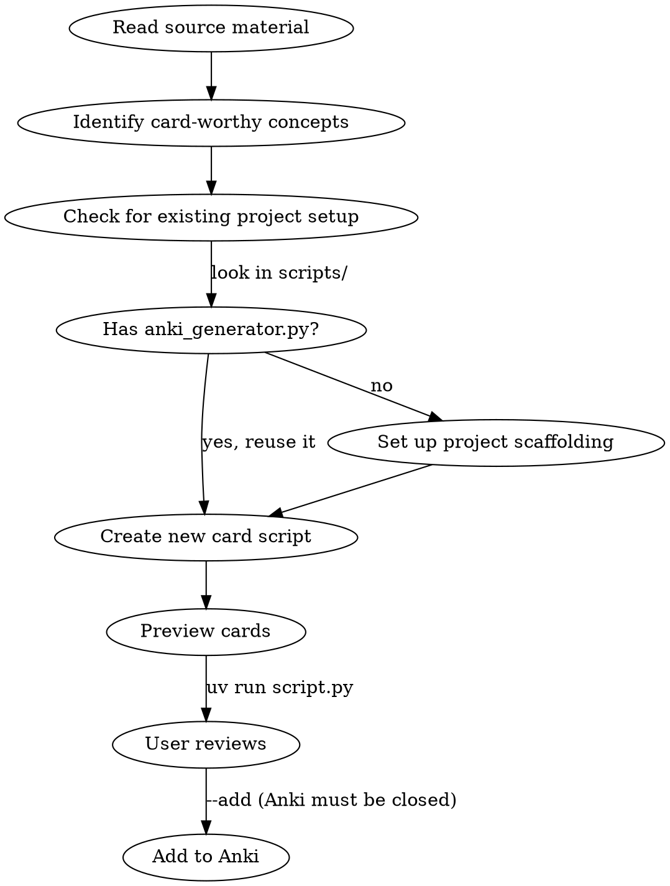

# Creating Anki Cards Skill Redesign — Implementation Plan

> **For Claude:** REQUIRED SUB-SKILL: Use superpowers:executing-plans to implement this plan task-by-task.

**Goal:** Rewrite the creating-anki-cards SKILL.md with principles-first structure, new card patterns, and broadened scope.

**Architecture:** Single-file rewrite of `plugins/accelerated-learning/skills/creating-anki-cards/SKILL.md`. No new files, no tooling changes. Content restructure only.

**Tech Stack:** Markdown (SKILL.md format with YAML frontmatter)

**Design doc:** `docs/plans/2026-02-26-creating-anki-cards-redesign.md`

---

### Task 1: Rewrite SKILL.md

**Files:**
- Modify: `plugins/accelerated-learning/skills/creating-anki-cards/SKILL.md` (full rewrite)

**Step 1: Replace the entire SKILL.md with the restructured content**

Write the following to `plugins/accelerated-learning/skills/creating-anki-cards/SKILL.md`:

````markdown
---
name: creating-anki-cards
description: Use when creating Anki flashcards from any learning material — course slides, PDFs, books, documentation, articles, or assignments. Use when user mentions Anki, flashcards, spaced repetition, or studying.
---

# Creating Anki Cards

## Overview

Generate high-quality Anki flashcards from learning materials using fastanki. Core principle: **create atomic, interconnected cards that test concepts from multiple angles.** Good cards are small, honest to grade, and build a web of retrieval paths — not isolated facts.

## When to Use

- User wants flashcards from any learning material (slides, docs, books, articles)
- User completed an assignment and wants cards for tricky spots
- User mentions Anki, spaced repetition, or studying

## Workflow



## Foundational Principles

1. **Atomic cards** — Each card tests exactly one concept. The answer should be scannable in 5 seconds. If a card needs partial credit to grade, it's too big — split it.
2. **Selective redundancy** — Create two-way cards and multiple formulations of important concepts to build multiple retrieval paths. Stay within card count targets per source type (see Extraction Guidelines).
3. **Test the tricky part** — Focus on gotchas, surprising behaviors, and easy-to-confuse pairs. Skip obvious definitions unless the definition itself is counterintuitive.

## Card Patterns

### Two-Way Cards

For any term/concept pair, create cards in both directions:
- Forward: "What does X mean?" / Backward: "What term describes Y?"
- Forward: "What does `\d+` match?" / Backward: "What regex matches one or more digits?"

Not every card needs a reverse — use two-way for terminology, notation, and definitions that benefit from bidirectional recall.

### Cloze Deletions

Hide a key part of a statement and ask the learner to fill it in. Useful for:
- Formulas and syntax patterns: "In Python, `___` creates a shallow copy of a list" → `list.copy()` or `list[:]`
- Sequences and ordered steps
- Key phrases in definitions

Cloze cards work well with the atomicity principle — each deletion tests exactly one fact.

### Hierarchies

For superclass/subclass or category/member relationships, ask both directions:
- Top-down: "What are the subtypes of X?" (use sparingly — these can violate atomicity if the list is long)
- Bottom-up: "What category does Y belong to?"

Prefer bottom-up cards. If a top-down card lists more than 3-4 items, split it or use cloze deletions instead.

## Question Design

- **Ask about the tricky part**, not the obvious part
- **Use code in the question** when testing syntax recall
- **Frame as "what happens when..."** for gotcha cards
- **Ask the same concept multiple ways** — formal definition, informal intuition, code example, "what's the difference between X and Y?" This builds interconnected retrieval paths.
- **Avoid "list N things"** — split into separate cards, or use cloze deletions
- **Cache your insights** — if reading the material sparks an inference or connection beyond what's explicitly stated, verify it and make a card for it
- **Definition test**: before creating a "What is X?" card, ask: "Would someone who read this once already know this?" If yes, skip it. Only create definition cards when the definition is counterintuitive.

### What Makes a Card Worth Creating

**DO create cards for:**
- Gotchas and surprising behaviors (e.g., `{}` creates a dict, not a set)
- Easy-to-confuse pairs (e.g., `append` vs `extend`, `copy` vs `deepcopy`)
- Syntax you'll forget (e.g., ternary expression order, comprehension syntax)
- Common mistakes from assignments (e.g., `yield` vs `yield from`)

**DO NOT create cards for:**
- Broad definitions ("What is X?") — unless the definition itself is surprising
- Content the learner already knows well
- Every bullet point from the source — be selective

### Atomicity Example

```python
# BAD: Code dump as answer (too much to review)
Card(
    "Implement BSTree __contains__ iteratively.",
    "<pre>def __contains__(self, element):\n"
    "    node = self.root\n"
    "    while node is not None:\n"
    "        if element == node.val:\n"
    "            return True\n"
    "        elif element < node.val:\n"
    "            node = node.left\n"
    "        else:\n"
    "            node = node.right\n"
    "    return False</pre>",
    make_tags("bstree"),
)

# GOOD: Tests the key insight, not the full implementation
Card(
    "BSTree <code>__contains__</code>: where should <code>return False</code> go?",
    "<b>After</b> the while loop, not inside it. "
    "Falling off the bottom of the loop means the element wasn't found.",
    make_tags("bstree", "gotcha"),
)
```

## Answer Formatting

- Use `<code>` for inline code, `<pre>` for short blocks (3-4 lines max)
- Use `<b>` to highlight the key insight
- Use `<br>` for line breaks
- Keep answers under 4-5 lines of text
- If the answer needs more than 5 lines, the card is too big — split it

## Extracting from Source Materials

### From Course Slides (Markdown or PDF)

**Target: 20-35 cards per lecture**

1. Read the slide file
2. Check existing card scripts for overlapping topics — don't duplicate cards from earlier lectures
3. Focus on: code examples with non-obvious behavior, comparisons (with/without, before/after), gotchas mentioned in comments
4. Skip: section headers that are just topic labels, obvious syntax that's common across languages
5. For PDF slides with annotations: prioritize highlighted/annotated passages, also scan for code examples, comparison tables, warning boxes

### From Assignments

**Target: 10-20 cards per assignment**

Focus on **tricky implementation spots**, not full solutions:
- What's the ONE thing a student would get wrong?
- What's the non-obvious constraint? (e.g., "do this in a single line")
- What's the gotcha in the data structure or algorithm?
- What's the edge case that breaks naive implementations?

### From Books / Documentation / Articles

**Target: 10-25 cards per chapter or major section**

1. Read the material and identify key concepts, definitions, and surprising details
2. Prioritize: counterintuitive facts, precise technical distinctions, common pitfalls
3. Use two-way cards liberally for terminology
4. Use cloze deletions for formulas, syntax patterns, and sequences
5. Cache your insights — create cards for inferences and connections you make while reading
6. Skip: background context, motivational framing, content you already know

## Project Setup

### Existing fastanki Project

If the project already has `scripts/anki_generator.py` (like cis1902), follow its pattern:

```python
from anki_generator import Card, run

LECTURE_ID = "lecture_N_topic"
TAGS = ["course-id", "lectureN", "topic"]

def make_tags(*extra):
    return TAGS + list(extra)

cards = [
    Card("question", "answer", make_tags("subtopic")),
]

if __name__ == "__main__":
    run(cards, LECTURE_ID)
```

### New Project

1. Check if `fastanki` is available: `pip show fastanki` or check `pyproject.toml`
2. If not, add it: `uv add fastanki` (or `pip install fastanki`)
3. Copy the `anki_generator.py` module from a reference project
4. Set `DECK` in `anki_generator.py` to the course name (e.g., `"CIS 1902::Python"`)
5. Use `::` for deck hierarchy (e.g., `"Course::Topic"`)

### Running

```bash
uv run scripts/lecture_N_topic.py          # preview in terminal
uv run scripts/lecture_N_topic.py --tsv    # export TSV for manual import
uv run scripts/lecture_N_topic.py --add    # add to Anki (Anki must be CLOSED)
```

## Common Mistakes

| Mistake | Fix |
|---------|-----|
| Cards with 10+ line code answers | Split into concept cards; test the insight, not the implementation |
| "What is X?" for every topic | Only create definition cards when the definition is surprising |
| Pasting full solutions | Isolate the gotcha — what would someone get wrong? |
| Only single-direction cards for terminology | Add reverse cards for important terms and notation |
| Missing cloze cards for sequences/formulas | Use cloze deletions when testing ordered or fill-in-the-blank knowledge |
| Duplicating earlier material | Check existing card scripts before creating new ones |
| Missing tags | Always tag by topic for filtered study sessions |
| Forgetting `make_tags()` helper | Keeps base tags consistent across all cards in a script |
| 40+ cards for one source | Be more selective — focus on gotchas, use card count targets |
````

**Step 2: Validate the plugin**

Run: `claude plugin validate .`
Expected: Validation passes (the plugin manifest and skill structure are unchanged)

**Step 3: Commit**

```bash
git add plugins/accelerated-learning/skills/creating-anki-cards/SKILL.md
git commit -m "feat: redesign creating-anki-cards skill with spaced repetition best practices

Add foundational principles, card patterns (two-way, cloze, hierarchies),
broadened scope to books/docs/articles, and updated extraction guidelines.
Based on borretti.me/article/effective-spaced-repetition."
```

---

### Task 2: Verify and clean up

**Step 1: Read back the committed file to verify structure**

Run: `head -20 plugins/accelerated-learning/skills/creating-anki-cards/SKILL.md`
Expected: YAML frontmatter with updated description, followed by "# Creating Anki Cards"

**Step 2: Run git log to verify commit**

Run: `git log --oneline -3`
Expected: Latest commit is the skill redesign
