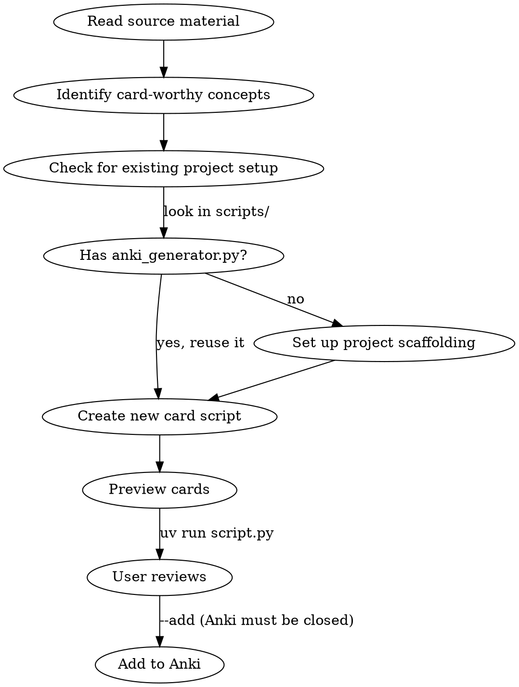

# Creating Anki Cards

## Overview

Generate high-quality Anki flashcards from course materials using fastanki. The key insight: **good flashcards test one atomic concept with a concise answer**, not dump definitions or full code listings.

## When to Use

- User wants flashcards from slides (markdown or PDF)
- User completed an assignment and wants cards for tricky spots
- User mentions Anki, spaced repetition, or studying

## Workflow



## Card Design Principles

### What Makes a Card Worth Creating

**DO create cards for:**
- Gotchas and surprising behaviors (e.g., `{}` creates a dict, not a set)
- Easy-to-confuse pairs (e.g., `append` vs `extend`, `copy` vs `deepcopy`)
- Syntax you'll forget (e.g., ternary expression order, comprehension syntax)
- Common mistakes from assignments (e.g., `yield` vs `yield from`)

**DO NOT create cards for:**
- Broad definitions ("What is X?") — unless the definition itself is surprising
- Content the student already knows well
- Every bullet point from the slides — be selective

### The Atomic Rule

Each card tests **exactly one concept**. The answer should be **scannable in 5 seconds**.

```python
# BAD: Code dump as answer (too much to review)
Card(
    "Implement BSTree __contains__ iteratively.",
    "<pre>def __contains__(self, element):\n"
    "    node = self.root\n"
    "    while node is not None:\n"
    "        if element == node.val:\n"
    "            return True\n"
    "        elif element < node.val:\n"
    "            node = node.left\n"
    "        else:\n"
    "            node = node.right\n"
    "    return False</pre>",
    make_tags("bstree"),
)

# GOOD: Tests the key insight, not the full implementation
Card(
    "BSTree <code>__contains__</code>: where should <code>return False</code> go?",
    "<b>After</b> the while loop, not inside it. "
    "Falling off the bottom of the loop means the element wasn't found.",
    make_tags("bstree", "gotcha"),
)
```

### Question Design

- **Ask about the tricky part**, not the obvious part
- **Use code in the question** when testing syntax recall
- **Frame as "what happens when..."** for gotcha cards
- **Avoid "list N things"** — split into separate cards
- **Definition test**: before creating a "What is X?" card, ask: "Would a student who read the slides once already know this?" If yes, skip it. Only create definition cards when the definition is counterintuitive.

### Card Count

- Aim for **20-35 cards per lecture** — enough to cover key concepts, not so many that review becomes a chore
- For assignments: **10-20 cards** focusing exclusively on gotchas and tricky spots
- If you're over 35 cards for a lecture, you're probably including too many definitions

### Answer Formatting

- Use `<code>` for inline code, `<pre>` for short blocks (3-4 lines max)
- Use `<b>` to highlight the key insight
- Use `<br>` for line breaks
- Keep answers under 4-5 lines of text
- If the answer needs more than 5 lines, the card is too big — split it

## Extracting from Source Materials

### From Markdown Slides

1. Read the slide file
2. Check existing card scripts for overlapping topics — don't duplicate cards from earlier lectures
3. Focus on: code examples with non-obvious behavior, comparisons (with/without, before/after), gotchas mentioned in comments
4. Skip: section headers that are just topic labels, obvious syntax that's common across languages

### From PDF Slides with Annotations

1. Read the PDF using the Read tool
2. Look for highlighted/annotated passages — these indicate what the user found important
3. Prioritize annotated content for cards
4. Also scan for: code examples, comparison tables, warning boxes

### From Assignments

Focus on **tricky implementation spots**, not full solutions:
- What's the ONE thing a student would get wrong?
- What's the non-obvious constraint? (e.g., "do this in a single line")
- What's the gotcha in the data structure or algorithm?
- What's the edge case that breaks naive implementations?

## Project Setup

### Existing fastanki Project

If the project already has `scripts/anki_generator.py` (like cis1902), follow its pattern:

```python
from anki_generator import Card, run

LECTURE_ID = "lecture_N_topic"
TAGS = ["course-id", "lectureN", "topic"]

def make_tags(*extra):
    return TAGS + list(extra)

cards = [
    Card("question", "answer", make_tags("subtopic")),
]

if __name__ == "__main__":
    run(cards, LECTURE_ID)
```

### New Project

1. Check if `fastanki` is available: `pip show fastanki` or check `pyproject.toml`
2. If not, add it: `uv add fastanki` (or `pip install fastanki`)
3. Copy the `anki_generator.py` module from a reference project
4. Set `DECK` in `anki_generator.py` to the course name (e.g., `"CIS 1902::Python"`)
5. Use `::` for deck hierarchy (e.g., `"Course::Topic"`)

### Running

```bash
uv run scripts/lecture_N_topic.py          # preview in terminal
uv run scripts/lecture_N_topic.py --tsv    # export TSV for manual import
uv run scripts/lecture_N_topic.py --add    # add to Anki (Anki must be CLOSED)
```

## Common Mistakes

| Mistake | Fix |
|---------|-----|
| Cards with 10+ line code answers | Split into concept cards; test the insight, not the implementation |
| "What is X?" for every topic | Only create definition cards when the definition is surprising |
| Pasting full assignment solutions | Isolate the gotcha — what would a student get wrong? |
| Overlapping cards | Merge cards that test the same concept from different angles |
| Duplicating earlier lectures | Check existing card scripts before creating new ones |
| Missing tags | Always tag by topic for filtered study sessions |
| Forgetting `make_tags()` helper | Keeps base tags consistent across all cards in a script |
| 40+ cards for one lecture | Be more selective — focus on gotchas, cut definitions |
