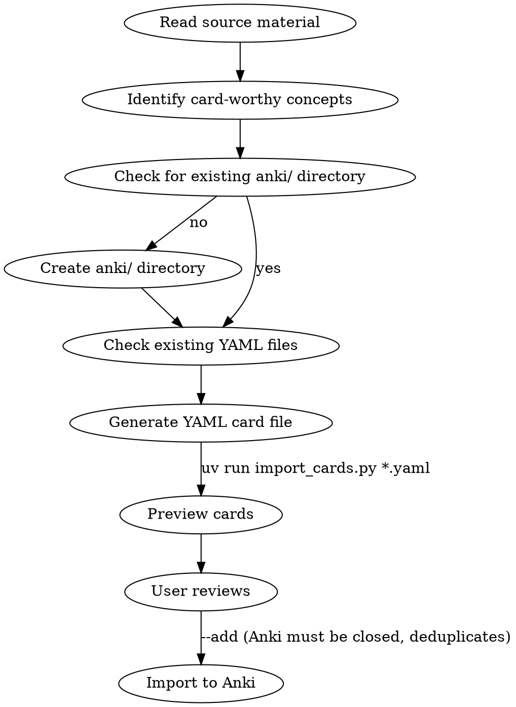

# Creating Anki Cards

## Overview

Generate high-quality Anki flashcards from learning materials as YAML files. Core principle: **create atomic, interconnected cards that test concepts from multiple angles.** Good cards are small, honest to grade, and build a web of retrieval paths — not isolated facts.

## When to Use

- User wants flashcards from any learning material (slides, docs, books, articles)
- User completed an assignment and wants cards for tricky spots
- User mentions Anki, spaced repetition, or studying

## Workflow


```dot
digraph anki_workflow {
  "Read source material" -> "Identify card-worthy concepts";
  "Identify card-worthy concepts" -> "Check for existing anki/ directory";
  "Check for existing anki/ directory" -> "Create anki/ directory" [label="no"];
  "Check for existing anki/ directory" -> "Check existing YAML files" [label="yes"];
  "Create anki/ directory" -> "Check existing YAML files";
  "Check existing YAML files" -> "Generate YAML card file";
  "Generate YAML card file" -> "Preview cards" [label="uv run import_cards.py *.yaml"];
  "Preview cards" -> "User reviews";
  "User reviews" -> "Import to Anki" [label="--add (Anki must be closed, deduplicates)"];
}
```

## Foundational Principles

1. **Atomic cards** — Each card tests exactly one concept. The answer should be scannable in 5 seconds. If a card needs partial credit to grade, it's too big — split it.
2. **Selective redundancy** — Create two-way cards and multiple formulations of important concepts to build multiple retrieval paths. Stay within card count targets per source type (see Extraction Guidelines).
3. **Test the tricky part** — Focus on gotchas, surprising behaviors, and easy-to-confuse pairs. Skip obvious definitions unless the definition itself is counterintuitive.

## Card Patterns

### Two-Way Cards

For any term/concept pair, create cards in both directions:

- Forward: "What does X mean?" / Backward: "What term describes Y?"
- Forward: "What does `\d+` match?" / Backward: "What regex matches one or more digits?"

Not every card needs a reverse — use two-way for terminology, notation, and definitions that benefit from bidirectional recall.

### Cloze Deletions

Hide a key part of a statement and ask the learner to fill it in. Useful for:

- Formulas and syntax patterns: "In Python, `___` creates a shallow copy of a list" → `list.copy()` or `list[:]`
- Sequences and ordered steps
- Key phrases in definitions

Cloze cards work well with the atomicity principle — each deletion tests exactly one fact.

### Hierarchies

For superclass/subclass or category/member relationships, ask both directions:

- Top-down: "What are the subtypes of X?" (use sparingly — these can violate atomicity if the list is long)
- Bottom-up: "What category does Y belong to?"

Prefer bottom-up cards. If a top-down card lists more than 3-4 items, split it or use cloze deletions instead.

## Question Design

- **Ask about the tricky part**, not the obvious part
- **Use code in the question** when testing syntax recall
- **Frame as "what happens when..."** for gotcha cards
- **Ask the same concept multiple ways** — formal definition, informal intuition, code example, "what's the difference between X and Y?" This builds interconnected retrieval paths.
- **Avoid "list N things"** — split into separate cards, or use cloze deletions
- **Cache your insights** — if reading the material sparks an inference or connection beyond what's explicitly stated, verify it and make a card for it
- **Definition test**: before creating a "What is X?" card, ask: "Would someone who read this once already know this?" If yes, skip it. Only create definition cards when the definition is counterintuitive.

### What Makes a Card Worth Creating

**DO create cards for:**

- Gotchas and surprising behaviors (e.g., `{}` creates a dict, not a set)
- Easy-to-confuse pairs (e.g., `append` vs `extend`, `copy` vs `deepcopy`)
- Syntax you'll forget (e.g., ternary expression order, comprehension syntax)
- Common mistakes from assignments (e.g., `yield` vs `yield from`)

**DO NOT create cards for:**

- Broad definitions ("What is X?") — unless the definition itself is surprising
- Content the learner already knows well
- Every bullet point from the source — be selective

### Atomicity Example

```yaml
# BAD: Code dump as answer (too much to review)
- q: "Implement BSTree __contains__ iteratively."
  a: "<pre>def __contains__(self, element):\n    node = self.root\n    while node is not None:\n        if element == node.val:\n            return True\n        elif element &lt; node.val:\n            node = node.left\n        else:\n            node = node.right\n    return False</pre>"
  tags: [bstree]

# GOOD: Tests the key insight, not the full implementation
- q: "BSTree <code>__contains__</code>: where should <code>return False</code> go?"
  a: "<b>After</b> the while loop, not inside it. Falling off the bottom of the loop means the element wasn't found."
  tags: [bstree, gotcha]
```

## Answer Formatting

- Use `<code>` for inline code, `<pre>` for short blocks (3-4 lines max)
- Use `<b>` to highlight the key insight
- Use `<br>` for line breaks
- Keep answers under 4-5 lines of text
- If the answer needs more than 5 lines, the card is too big — split it

## Extracting from Source Materials

### From Course Slides (Markdown or PDF)

**Target: 20-35 cards per lecture**

1. Read the slide file
2. Check existing YAML files in `anki/` for overlapping topics — don't duplicate cards from earlier lectures
3. Focus on: code examples with non-obvious behavior, comparisons (with/without, before/after), gotchas mentioned in comments
4. Skip: section headers that are just topic labels, obvious syntax that's common across languages
5. For PDF slides with annotations: prioritize highlighted/annotated passages, also scan for code examples, comparison tables, warning boxes

### From Assignments

**Target: 10-20 cards per assignment**

Focus on **tricky implementation spots**, not full solutions:

- What's the ONE thing a student would get wrong?
- What's the non-obvious constraint? (e.g., "do this in a single line")
- What's the gotcha in the data structure or algorithm?
- What's the edge case that breaks naive implementations?

### From Books / Documentation / Articles

**Target: 10-25 cards per chapter or major section**

1. Read the material and identify key concepts, definitions, and surprising details
2. Prioritize: counterintuitive facts, precise technical distinctions, common pitfalls
3. Use two-way cards liberally for terminology
4. Use cloze deletions for formulas, syntax patterns, and sequences
5. Cache your insights — create cards for inferences and connections you make while reading
6. Skip: background context, motivational framing, content you already know

## Project Setup

### First Time

1. Create an `anki/` directory in the project root
2. This is where all YAML card files will live

### Adding Cards

1. Check existing YAML files in `anki/` for overlapping topics — don't duplicate
2. Create a new YAML file in `anki/` following the format below

### Deck Naming

**Before creating a new YAML file, always `grep "^deck:" anki/*.yaml | sort -u` to see established naming conventions.** Match the existing pattern.

Derive the deck hierarchy from the source material's context — file path, tags, and calling skill all provide signal:

- Course slides `Lecture 3 — Trees.pdf` → `CS 101::Trees`
- Book chapter `Chapter 5 — Concurrency.md` → `DDIA::Concurrency`
- Coding problem `problems/two-sum.md` → `LeetCode::Arrays::Two Sum`

Pattern: `<Domain>::<Category>::<Specific Topic or Problem Name>`. The leaf should be the problem or topic name, not a generic label like "Data Structures."

### YAML Card Format

```yaml
deck: "CS 101::Binary Trees"
source: lecture_5_trees
tags: [cs101, data-structures]

cards:
  - q: "Question text with <code>inline code</code>?"
    a: "Answer with <b>key insight</b> highlighted."
    tags: [subtopic]
  - q: "Another question?"
    a: "Another answer."
    tags: [subtopic, gotcha]
```

- `deck` — Anki deck name, use `::` for hierarchy (see Deck Naming above)
- `source` — identifier for this set of cards (e.g., `lecture_1_basics`)
- `tags` (file-level) — applied to ALL cards in the file
- `tags` (per-card) — merged with file-level tags
- `q`/`a` — question and answer, HTML formatting allowed

### Running

The import script is bundled with this skill. Replace `<skill-path>` with the actual path to this skill's directory.

```bash
uv run <skill-path>/import_cards.py anki/*.yaml          # preview in terminal
uv run <skill-path>/import_cards.py anki/*.yaml --tsv    # export TSV for manual import
uv run <skill-path>/import_cards.py anki/*.yaml --add    # add to Anki (must be CLOSED, deduplicates)
```

The `--add` flag automatically skips cards that already exist in Anki (matching on question text), so it's safe to re-run after retries or updates.

## Common Mistakes

| Mistake                                     | Fix                                                                     |
| ------------------------------------------- | ----------------------------------------------------------------------- |
| Cards with 10+ line code answers            | Split into concept cards; test the insight, not the implementation      |
| "What is X?" for every topic                | Only create definition cards when the definition is surprising          |
| Pasting full solutions                      | Isolate the gotcha — what would someone get wrong?                      |
| Only single-direction cards for terminology | Add reverse cards for important terms and notation                      |
| Missing cloze cards for sequences/formulas  | Use cloze deletions when testing ordered or fill-in-the-blank knowledge |
| Duplicating earlier material                | Check existing YAML files in anki/ before creating new ones             |
| Missing tags                                | Always tag by topic for filtered study sessions                         |
| Missing file-level tags                     | Set base tags at file level so per-card tags only need subtopics        |
| 40+ cards for one source                    | Be more selective — focus on gotchas, use card count targets            |
| Generic deck name ("Data Structures")       | Grep existing YAML files for conventions; derive from source file path  |
