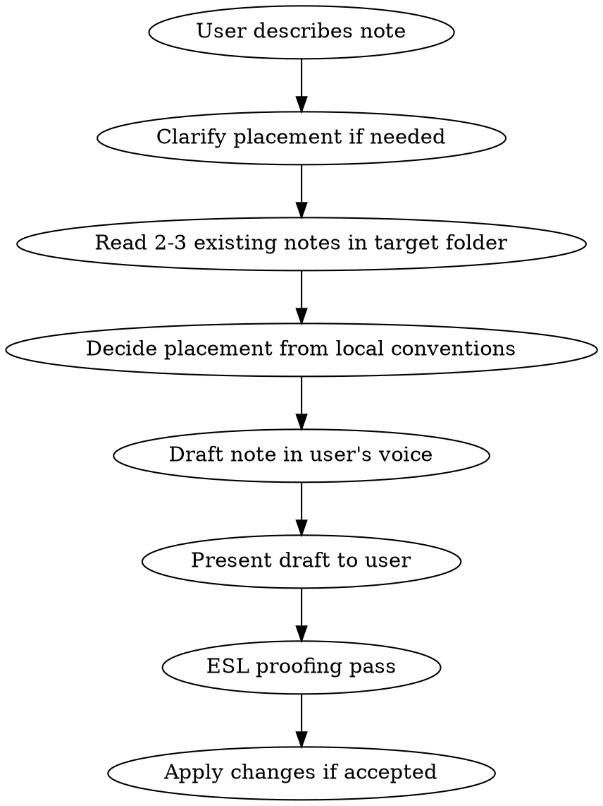

# Drafting Notes

## Overview

Help the user draft new original notes for the target note workspace. The core principle: **preserve the user's voice**. You are a scribe, not an editor.

## Workflow



## Step 1: Clarify Placement

Ask **one placement question only if needed**. Examples: published/shared/private, target collection, course folder, project, or topic area.

Do NOT ask about tags, formatting, or other metadata — match what existing notes in the target folder do.

### Folder Decision

1. **Inspect first** — Look at the workspace's existing folders and naming conventions before choosing a path.
2. **Prefer the closest local convention** — If the workspace uses PARA, place the note in the relevant project, area, or resource folder. Otherwise use the closest topic, course, project, collection, or inbox convention.
3. **Ask before inventing structure** — If no destination is obvious, propose one or two paths and ask the user to choose.
4. **Never assume bookmark/link-post taxonomy** — Do not classify original notes as bookmarks, link posts, or external-source annotations unless the user asks or the workspace already has that convention.

## Step 2: Read Before Writing

Read 2-3 existing notes in the target folder to match:

- Frontmatter style (usually just `created: YYYY-MM-DD`)
- Tone and structure
- Heading conventions

## Step 3: Draft in the User's Voice

**This is the most important step.**

- Use the user's own words and phrasing as much as possible
- Keep first-person voice if they spoke in first person
- Do NOT rephrase casual language into formal/technical prose
- Do NOT add explanatory content the user didn't provide
- Do NOT add context, background, or "helpful" elaboration
- Keep it the length the user indicated ("short note" = short note)

### Frontmatter

Match existing notes in the target folder. Default to:

```yaml
---
created: YYYY-MM-DD
---
```

Only add `tags:` if there's a clear convention in the folder.

## Step 4: ESL Proofing

After the user confirms the content, always offer language suggestions:

- Flag awkward phrasing, unnatural word choices, or grammar issues
- Suggest 2-3 specific fixes with brief explanations of why
- Keep the user's casual tone — fix grammar, don't formalize
- Apply only if the user agrees

## AI Disclosure

Drafted notes do not need AI disclosure unless the AI substantially rewrites or generates original content beyond what the user provided. When disclosure is needed, use the workspace's normal disclosure format.

## Common Mistakes

| Mistake                                        | Fix                                                                          |
| ---------------------------------------------- | ---------------------------------------------------------------------------- |
| Over-formalizing user's voice                  | Use their words. "It took some digging" not "The documentation is scattered" |
| Placing in a generic notes folder too early    | Check the workspace's established organization first                         |
| Adding explanatory content user didn't provide | Only write what they told you                                                |
| Asking too many questions upfront              | Ask only the placement question needed to choose the target folder           |
| Skipping ESL proofing                          | Always offer, even if writing looks fine                                     |
| Using bookmark tags for original content       | Only use bookmark/link-post taxonomy when the workspace already does         |
