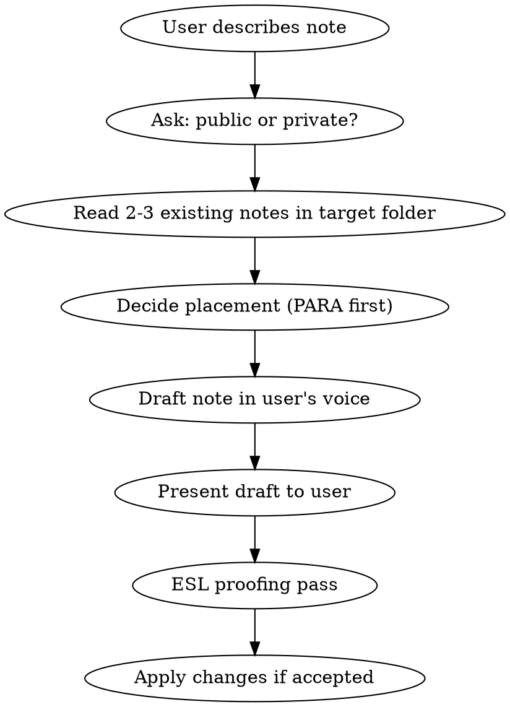

# Drafting Notes

## Overview

Help the user draft new original notes for the Quartz vault. The core principle: **preserve the user's voice**. You are a scribe, not an editor.

## Workflow



## Step 1: Clarify Placement

Ask **one question**: public or private?

Do NOT ask about tags, formatting, or other metadata — match what existing notes in the target folder do.

### Folder Decision

1. **PARA first** — Check if the topic fits an existing area under `content/notes/areas/` (public) or `content/private/areas/` (private). If yes, place there.
2. **Fallback** — Only use top-level `content/notes/` (public) or a private collection folder like `content/private/books/`, `content/private/writings/` if no PARA area fits.
3. **Never assume blogmark** — Blogmarks annotate external content with `tags: [Blogmarks]`. If the user is writing original content (even referencing external docs), it's NOT a blogmark.

## Step 2: Read Before Writing

Read 2-3 existing notes in the target folder to match:

- Frontmatter style (usually just `created: YYYY-MM-DD`)
- Tone and structure
- Heading conventions

## Step 3: Draft in the User's Voice

**This is the most important step.**

- Use the user's own words and phrasing as much as possible
- Keep first-person voice if they spoke in first person
- Do NOT rephrase casual language into formal/technical prose
- Do NOT add explanatory content the user didn't provide
- Do NOT add context, background, or "helpful" elaboration
- Keep it the length the user indicated ("short note" = short note)

### Frontmatter

Match existing notes in the target folder. Default to:

```yaml
---
created: YYYY-MM-DD
---
```

Only add `tags:` if there's a clear convention in the folder.

## Step 4: ESL Proofing

After the user confirms the content, always offer language suggestions:

- Flag awkward phrasing, unnatural word choices, or grammar issues
- Suggest 2-3 specific fixes with brief explanations of why
- Keep the user's casual tone — fix grammar, don't formalize
- Apply only if the user agrees

## AI Disclosure

Drafted notes do NOT need the `[!info] AI-assisted annotations` callout — the user is the author, you're just formatting. Only add it if the AI substantially rewrites or generates original content beyond what the user provided.

## Common Mistakes

| Mistake                                        | Fix                                                                          |
| ---------------------------------------------- | ---------------------------------------------------------------------------- |
| Over-formalizing user's voice                  | Use their words. "It took some digging" not "The documentation is scattered" |
| Placing in notes/ without considering PARA     | Check areas/ first                                                           |
| Adding explanatory content user didn't provide | Only write what they told you                                                |
| Asking too many questions upfront              | Just ask public or private                                                   |
| Skipping ESL proofing                          | Always offer, even if writing looks fine                                     |
| Using blogmark tags for original content       | Blogmarks annotate external articles, not original notes                     |
