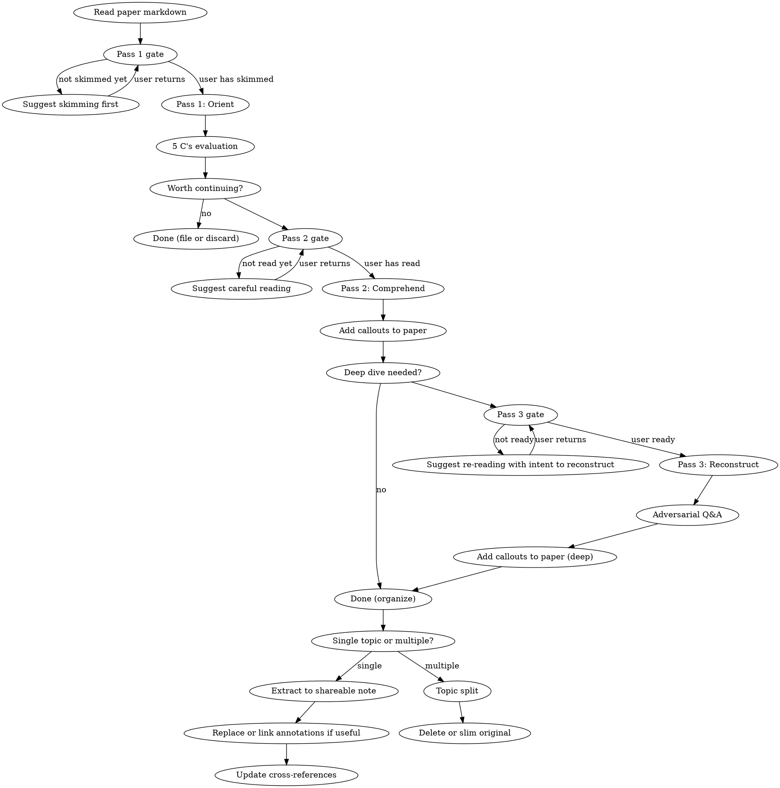

# Reading Papers

## Overview

Three-pass study flow for academic papers, based on [Keshav's framework (2007)](https://doi.org/10.1145/1273445.1273458) with LLM assistance at each stage. Papers can be markdown notes, PDFs, or converted source documents; use the workspace's existing paper storage location and available conversion output. Each pass has a distinct goal, and the user must engage independently before the LLM deepens understanding.

## Workflow

## Phase 0: Reading Gate (Before Each Pass)

**The LLM deepens understanding — it must not replace reading.**

Before each pass, confirm the user has done the independent work:

| Pass | Independent work required                    | Gate question                                                                  |
| ---- | -------------------------------------------- | ------------------------------------------------------------------------------ |
| 1    | Skim title, abstract, headings, conclusions  | "Have you skimmed the paper? What's your first impression?"                    |
| 2    | Read with care, study figures and diagrams   | "Have you read through the paper? What terms or sections were unclear?"        |
| 3    | Attempt to mentally reconstruct the argument | "Have you tried reconstructing the paper's argument? Where did you get stuck?" |

**If the user hasn't read yet:** suggest they do so and come back. Don't summarize or spoil. The gate question doubles as a lightweight comprehension check — their answer focuses the upcoming LLM-assisted pass.

## Phase 1: Orient (First Pass)

**Goal:** General idea of the paper. Decide whether to continue.

**Time investment:** User spends 5-10 minutes skimming independently, then LLM session.

After the user passes the gate:

1. **Summarize structure** — what kind of paper is this, how is it organized
2. **Evaluate the 5 C's together:**
   - **Category** — measurement, analysis, prototype, survey, theoretical?
   - **Context** — what other work is this related to? What theoretical bases?
   - **Correctness** — do the assumptions appear valid?
   - **Contributions** — what are the main contributions?
   - **Clarity** — is it well written?
3. **Surface key references as described by the paper** — note which works the authors position themselves against or build upon, based on how the paper cites them
4. **Explicit gate:** "Based on this, is this paper worth a second pass? If it's outside your area or the contributions aren't relevant, it's fine to stop here."

### Annotations for Pass 1

Use the workspace's annotation syntax. In Obsidian-style workspaces:

- `[!info]` for the 5 C's evaluation
- `[!warning]` for red flags (questionable assumptions, missing context)

## Phase 2: Comprehend (Second Pass)

**Goal:** Grasp the paper's content, but not every detail. Be able to summarize the main thrust with supporting evidence to someone else.

**Time investment:** User spends up to 1 hour reading independently, then LLM session.

After the user passes the gate:

1. **No spoilers** — do not preemptively summarize sections the user hasn't asked about. Follow Jeremy Howard's approach: answer what's asked, don't reveal what's ahead.
2. **Clarify flagged terms and sections** — the user identified unclear parts at the gate. Explain these with references and citations to related work, not just definitions. This is the key acceleration point.
3. **Walk through figures and diagrams** — describe what the LLM can see in the available source or conversion output first. Only ask the user for clarification if something appears garbled or missing.
4. **Surface connections as the paper describes them** — when explaining a concept, cite how the paper itself frames its references ("the authors cite X as..."). Add context from training knowledge only when confident, and flag uncertainty explicitly ("I believe this paper is about... but I haven't verified"). Never present inferred knowledge about a reference as fact.
5. **Mark references for future reading** — flag papers from the bibliography that the paper describes as foundational or that appear frequently in the argument. The user should read key references themselves rather than rely on the LLM's knowledge of them.
6. **Check comprehension** — after addressing the user's questions, ask them to summarize the main thrust of the paper with supporting evidence (Keshav's bar for pass 2).

### Annotations for Pass 2

Use the workspace's annotation syntax. In Obsidian-style workspaces:

- `[!question]` for Q&A about unclear terms and concepts
- `[!info]` for supplementary context, related work, and reference suggestions
- `[!example]` for concrete illustrations of abstract concepts
- `[!warning]` for common misconceptions about the techniques or results

## Phase 3: Reconstruct (Third Pass)

**Goal:** Virtually re-implement the paper — make the same assumptions as the authors, attempt to re-create the work. Identify innovations, hidden assumptions, and weaknesses.

**Time investment:** User spends 1-3 hours independently, then LLM session.

After the user passes the gate:

1. **Adversarial Q&A** — challenge the paper's claims:
   - "What happens if assumption X is wrong?"
   - "How would you design this experiment differently?"
   - "What's the weakest link in the argument chain?"
2. **Reconstruct the argument** — ask the user to walk through the paper's logic, LLM probes for gaps
3. **Compare with related work** — based on how the paper positions itself against cited work, probe whether the claimed differences hold up. Flag when the LLM lacks knowledge of a referenced paper.
4. **Identify what's novel vs. incremental** — what's the actual contribution beyond prior work?

### Annotations for Pass 3

Use the workspace's annotation syntax. In Obsidian-style workspaces:

- `[!question]` for adversarial Q&A exchanges
- `[!warning]` for identified weaknesses, hidden assumptions
- `[!example]` for alternative approaches or experimental designs discussed
- `[!info]` for connections to other work

## Phase 4: Organize

Follow the workspace's existing publish and organization conventions.

### Single-topic paper → Extracted Note

1. Create a destination note in the user-selected or workspace-standard notes/publishing location
2. Apply metadata/tags only when the workspace uses them
3. Preserve a DOI, source URL, or citation link
4. Add AI disclosure only when required by the user or publishing policy
5. If annotations are extracted out of the source note, replace or link them using the workspace's supported reference format

### Multi-topic paper → Topic Split

1. Ask user whether to keep one extracted note or split by topic
2. Follow the workspace's existing note organization conventions; if it uses PARA, use the configured PARA folders
3. Each file gets the workspace's normal metadata, disclosure, and source link when applicable
4. Handle original per user preference

### Cross-references

- Use the workspace's supported link format
- If an extracted note will be public or exported, avoid links to private or local-only notes
- Prefer DOI, citation, or source URLs for public/exported notes

## Common Mistakes

| Mistake                                             | Fix                                                                    |
| --------------------------------------------------- | ---------------------------------------------------------------------- |
| Summarizing paper before user has read it           | Always check reading gate first — each pass requires independent work  |
| Treating all passes the same (just Q&A)             | Each pass has a distinct goal: orient → comprehend → reconstruct       |
| Skipping the "worth continuing?" gate after Pass 1  | Explicitly ask — not every paper deserves three passes                 |
| LLM doing the reconstruction for the user in Pass 3 | User walks through the argument; LLM probes and challenges             |
| Forgetting the 5 C's in Pass 1                      | Always evaluate Category, Context, Correctness, Contributions, Clarity |
| Not marking unread references                       | Surface key references in Pass 1, mark relevant ones in Pass 2         |
| Assuming Obsidian block IDs always work             | Use block IDs only when supported; otherwise use headings or anchors    |
| Linking exported notes to private content           | Use DOI, citation, or source URLs for public/exported notes             |
