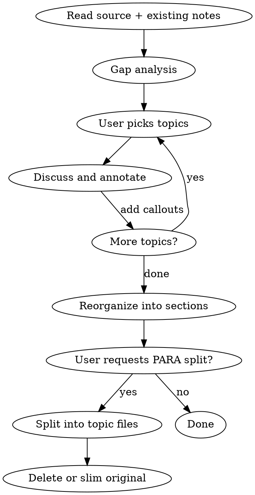

# Reviewing and Organizing Notes

## Overview

Review existing notes against source material, discuss and annotate topics, then reorganize into PARA-appropriate topic files. Complements studying-articles (which starts from new clippings); this skill starts from **existing notes** that need refinement.

## Workflow

## Phase 1: Gap Analysis

1. Read the source material (transcript, article, clipping)
2. Read the existing notes
3. Present a comparison:
   - **Well-captured:** topics the notes already cover well
   - **Missing:** rich material from the source not yet in the notes
4. Let the user decide which gaps to explore

**Do NOT** add content without user direction. Present options and let them choose.

## Phase 2: Discuss and Annotate

Follow studying-articles callout conventions:

| Type          | Use for                 |
| ------------- | ----------------------- |
| `[!question]` | Q&A about concepts      |
| `[!example]`  | Concrete examples       |
| `[!info]`     | Supplementary context   |
| `[!warning]`  | Misconceptions, gotchas |

**Rules:**

- Place callouts contextually after relevant content, not grouped at end
- One concept per callout, self-contained
- Use `==highlights==` for key takeaways
- No tables inside callouts
- Match the language the user is writing in

## Phase 3: Reorganize into Sections

When the user is done drilling into topics:

1. Identify natural topic groupings across all content (quotes + commentary)
2. Propose section headers — present to user before applying
3. Move content into sections, keeping quotes with their commentary
4. Content that doesn't fit neatly into one section stays closest to its primary topic

**Naming sections:** Use the user's language and framing. If notes are in Chinese, headers should be in Chinese (with English term in parentheses if helpful).

## Phase 4: PARA Split

When the user requests breaking into separate notes:

1. **Propose file mapping** — show a table of: topic → proposed file path → rationale
2. **Wait for user confirmation** before creating files
3. **PARA placement guide:**
   - `projects/` — tied to a specific short-term effort with a deadline
   - `areas/` — ongoing responsibility (self-improvement, economics, etc.)
   - `resources/` — reference material organized by topic, not tied to a project or area
   - `archive/` — inactive or outdated
4. **Each new file gets:**
   - Frontmatter with tags inherited from original note
   - AI disclosure callout: `> [!info] AI-assisted annotations` with brief description of what was helped and model info
   - Source link to the original article/podcast
   - Only the content relevant to its topic
5. **Handle the original note** per user preference:
   - Delete it (if fully split)
   - Slim it to an index linking to the new topic notes
   - Keep as-is (if split was partial)

**Before deleting the original**, confirm with the user.

## Common Mistakes

| Mistake                                        | Fix                                                                                              |
| ---------------------------------------------- | ------------------------------------------------------------------------------------------------ |
| Adding content without user direction          | Present gaps, let user choose what to explore                                                    |
| Reorganizing before discussion is done         | Complete annotation phase first                                                                  |
| Creating files without showing the plan        | Always propose file mapping and wait for confirmation                                            |
| Forcing content into PARA when user didn't ask | Reorganizing into sections and PARA split are separate steps                                     |
| Mixing languages inconsistently                | Match the user's language in commentary and headers                                              |
| Forgetting AI disclosure callout               | Every new or substantially edited note needs `[!info] AI-assisted annotations` after frontmatter |
