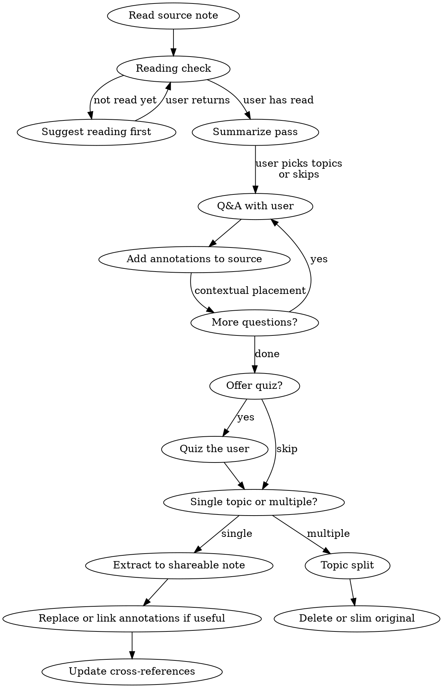

# Studying Articles

## Overview

Interactive study flow: read a saved article, clipping, or source note, discuss it via Q&A, annotate it, then optionally extract annotations into a separate shareable note with links back to the source.

## Workflow



## Phase 0: Reading Check & Summary

**First, confirm the user has engaged with the source material.** The study flow deepens understanding — it shouldn't replace reading.

1. **Ask if they've read the article** — a simple check, not a quiz gate
2. **If not yet**: suggest they read it first and come back when ready. Don't summarize or spoil the content.
3. **If yes**: ask what stood out or what they're curious about — this focuses the Q&A and doubles as a lightweight comprehension check

Then provide a brief overview of the source material:

1. **Key ideas** — what are the main concepts or arguments?
2. **Structure** — how is the content organized?
3. **Connect to user's interests** — tie the summary to what they mentioned stood out

**Skip option:** For short or lightweight articles, the user may say "skip summary" or jump straight to questions — that's fine. This pass is most valuable for dense, long, or multi-topic sources.

## Phase 1: Q&A and Annotation

### Tone

- User speaks informally — preserve their voice in annotations
- Synthesize the discussion, don't paste raw conversation
- Go beyond the source material: add context, history, connections

### Annotation Types

Use the workspace's annotation syntax. In Obsidian-style workspaces, these map to callouts:

| Type          | Use for                                 |
| ------------- | --------------------------------------- |
| `[!question]` | Q&A about concepts                      |
| `[!example]`  | Concrete examples, worked problems      |
| `[!info]`     | Supplementary context, cross-references |
| `[!warning]`  | Misconceptions, gotchas, open problems  |

### Annotation Rules

- Place **contextually after the relevant content**, not grouped at end
- One concept per annotation, self-contained
- Use the workspace's highlight syntax for key takeaways; otherwise use bold or bullets
- No tables inside callouts when using Obsidian callouts

## Phase 1b: Quiz (Optional)

When the Q&A phase wraps up, offer to quiz the user on the material:

- **Ask 3-5 questions** that test understanding of the key concepts discussed
- Focus on **application and connection**, not recall — e.g., "How would you apply X in situation Y?" rather than "What did the author say about X?"
- After each answer, give brief feedback and connect back to the source material
- **Skip if** the user declines or the article was lightweight

This is inspired by Jeremy Howard's active recall approach. The goal is to solidify understanding before moving to the publish/organize phase.

## Phase 2: Extract or Publish Annotations

When user says to publish/extract:

1. **Create extracted note** in the user-specified destination folder, preserving the filename or using a chosen slug
   - Use the workspace's metadata/tag convention; ask before adding tags if none exists
   - AI disclosure if required by user or publishing policy (see below)
   - Brief summary sentence of the source article
   - All discussion annotations from the source note
   - Obsidian block IDs only when the workspace uses Obsidian embeds/transclusions

2. **Replace or link annotations in the source note** when useful:
   - Use the workspace's supported reference format: Obsidian block embed when supported, otherwise Markdown links/backlinks
   - Resolve paths from the actual destination
   - Place each reference at the exact location where the annotation was

3. **Cross-references** in the extracted note:
   - If the extracted note will be public/exported, avoid links to private or local-only notes
   - Otherwise follow the workspace's normal link convention

### AI Disclosure

When disclosure is required, use the workspace's normal format. Example:

```markdown
> [!info] AI-assisted annotations
> <brief description of what was helped> with <assistant/tool/model if known>.
```

### Block ID Syntax

Use this only in Obsidian-style workspaces that support block IDs. Block IDs MUST be inside the blockquote on the last line:

```markdown
> [!question] Title
> Content here
> ^my-block-id
```

NOT on a separate line after the callout (creates a standalone block, breaks transclusion).

## Phase 2b: Topic Split

When the source material covers **multiple distinct topics** (e.g., a podcast touching product thinking, negotiation, and leadership), splitting into topic files may be better than one monolithic extracted note.

1. **Ask the user** whether to keep one extracted note or split by topic
2. **If splitting**, follow the workspace's existing note organization conventions:
   - Propose topic groupings and file mapping before acting
   - Each file gets the workspace's normal metadata, disclosure, and source link when applicable
   - If the workspace uses PARA, follow its configured folders; otherwise ask where topic notes should live
3. **Handle the original** per user preference (delete, slim to index, or keep)

**When to split vs. single extracted note:**

- Single topic with annotations → one extracted note
- Multiple distinct topics worth filing separately → topic split
- When in doubt, ask the user

## Common Mistakes

| Mistake                                               | Fix                                                                                              |
| ----------------------------------------------------- | ------------------------------------------------------------------------------------------------ |
| Block ID on own line after callout                    | Put `> ^id` on last line inside blockquote when using Obsidian block IDs                         |
| Assuming one fixed extracted-note path                | Resolve links from the actual destination                                                        |
| Linking exported notes to private content             | Use original source URLs for public/exported notes                                               |
| Grouping all annotations at end of note               | Place contextually after relevant content                                                        |
| Over-editing user's informal tone                     | Synthesize but preserve voice                                                                    |
| Forgetting AI disclosure policy                       | Follow the workspace's disclosure convention when notes are substantially AI-assisted            |
| Dumping multi-topic source into one extracted note    | Ask whether to split by topic into workspace-appropriate locations                               |
| Summarizing before confirming user has read           | Always check reading status first — study deepens understanding, doesn't replace reading         |
