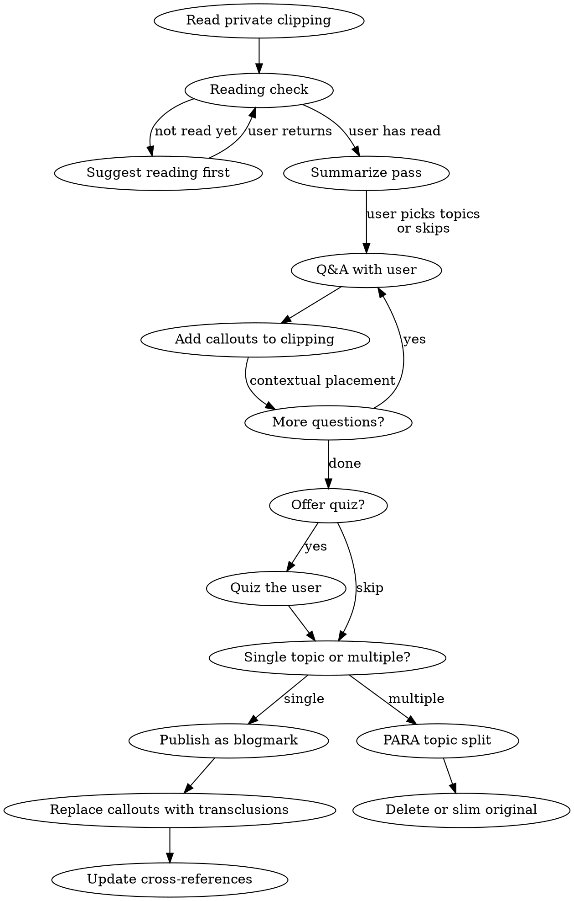

# Studying Articles

## Overview

Interactive study flow: read a private clipping, discuss it via Q&A, annotate the clipping with callouts, then publish discussions as a public blogmark with transclusions back to the private note.

## Workflow



## Phase 0: Reading Check & Summary

**First, confirm the user has engaged with the source material.** The study flow deepens understanding — it shouldn't replace reading.

1. **Ask if they've read the article** — a simple check, not a quiz gate
2. **If not yet**: suggest they read it first and come back when ready. Don't summarize or spoil the content.
3. **If yes**: ask what stood out or what they're curious about — this focuses the Q&A and doubles as a lightweight comprehension check

Then provide a brief overview of the source material:

1. **Key ideas** — what are the main concepts or arguments?
2. **Structure** — how is the content organized?
3. **Connect to user's interests** — tie the summary to what they mentioned stood out

**Skip option:** For short or lightweight articles, the user may say "skip summary" or jump straight to questions — that's fine. This pass is most valuable for dense, long, or multi-topic sources.

## Phase 1: Q&A and Annotation

### Tone

- User speaks informally — preserve their voice in callouts
- Synthesize the discussion, don't paste raw conversation
- Go beyond the source material: add context, history, connections

### Callout Types

| Type          | Use for                                 |
| ------------- | --------------------------------------- |
| `[!question]` | Q&A about concepts                      |
| `[!example]`  | Concrete examples, worked problems      |
| `[!info]`     | Supplementary context, cross-references |
| `[!warning]`  | Misconceptions, gotchas, open problems  |

### Callout Rules

- Place **contextually after the relevant content**, not grouped at end
- One concept per callout, self-contained
- Use `==highlights==` for key takeaways
- No tables inside callouts (breaks Obsidian rendering) — use bullet lists

## Phase 1b: Quiz (Optional)

When the Q&A phase wraps up, offer to quiz the user on the material:

- **Ask 3-5 questions** that test understanding of the key concepts discussed
- Focus on **application and connection**, not recall — e.g., "How would you apply X in situation Y?" rather than "What did the author say about X?"
- After each answer, give brief feedback and connect back to the source material
- **Skip if** the user declines or the article was lightweight

This is inspired by Jeremy Howard's active recall approach. The goal is to solidify understanding before moving to the publish/organize phase.

## Phase 2: Publish as Blogmark

When user says to publish/extract:

1. **Create public blogmark** at `content/notes/blogmarks/<same filename as private clipping>.md`
   - Frontmatter: `tags: [Blogmarks]`
   - AI disclosure callout (see below)
   - Brief summary sentence of the source article
   - All discussion callouts from the private clipping
   - Each callout gets a block ID on last line: `> ^block-id`

2. **Replace callouts in private clipping** with section transclusions:
   - `![[notes/blogmarks/<filename>#^block-id]]` (folder path required for disambiguation)
   - Place each transclusion at the exact location where the callout was

3. **Cross-references** in the public blogmark:
   - Public-to-public: wikilinks `[[Other Note]]`
   - Public-to-private: external URLs, never wikilinks

### AI Disclosure

Every public blogmark starts with:

```markdown
> [!info] AI-assisted annotations
> <brief description of what was helped> with Codex <model> via Codex.
```

### Block ID Syntax

Block IDs MUST be inside the blockquote on the last line:

```markdown
> [!question] Title
> Content here
> ^my-block-id
```

NOT on a separate line after the callout (creates a standalone block, breaks transclusion).

## Phase 2b: PARA Topic Split

When the source material covers **multiple distinct topics** (e.g., a podcast touching product thinking, negotiation, and leadership), splitting into topic files is better than one monolithic blogmark.

1. **Ask the user** whether to publish as a single blogmark or split by topic
2. **If splitting**, follow the reviewing-notes skill's Phase 3 (reorganize into sections) and Phase 4 (PARA split) conventions:
   - Propose topic groupings and file mapping before acting
   - Each file gets: frontmatter with tags, AI disclosure callout, source link
   - PARA placement: `notes/projects/` (public) or `private/projects/` for deadlines, `notes/areas/` or `private/areas/` for ongoing responsibilities, `notes/resources/` or `private/resources/` for reference material
3. **Handle the original** per user preference (delete, slim to index, or keep)

**When to split vs. single blogmark:**

- Single topic with your annotations → blogmark
- Multiple distinct topics worth filing separately → PARA split
- When in doubt, ask the user

## Common Mistakes

| Mistake                                               | Fix                                                                                              |
| ----------------------------------------------------- | ------------------------------------------------------------------------------------------------ |
| Block ID on own line after callout                    | Put `> ^id` on last line inside blockquote                                                       |
| Same filename in private + public without folder path | Always use `![[notes/blogmarks/filename#^id]]`                                                   |
| Wikilinks from public to private content              | Use original source URLs for private content                                                     |
| Grouping all callouts at end of note                  | Place contextually after relevant content                                                        |
| Over-editing user's informal tone                     | Synthesize but preserve voice                                                                    |
| Forgetting AI disclosure callout                      | Every new or substantially edited note needs `[!info] AI-assisted annotations` after frontmatter |
| Dumping multi-topic source into one blogmark          | Ask whether to split by topic into PARA locations                                                |
| Summarizing before confirming user has read           | Always check reading status first — study deepens understanding, doesn't replace reading         |
