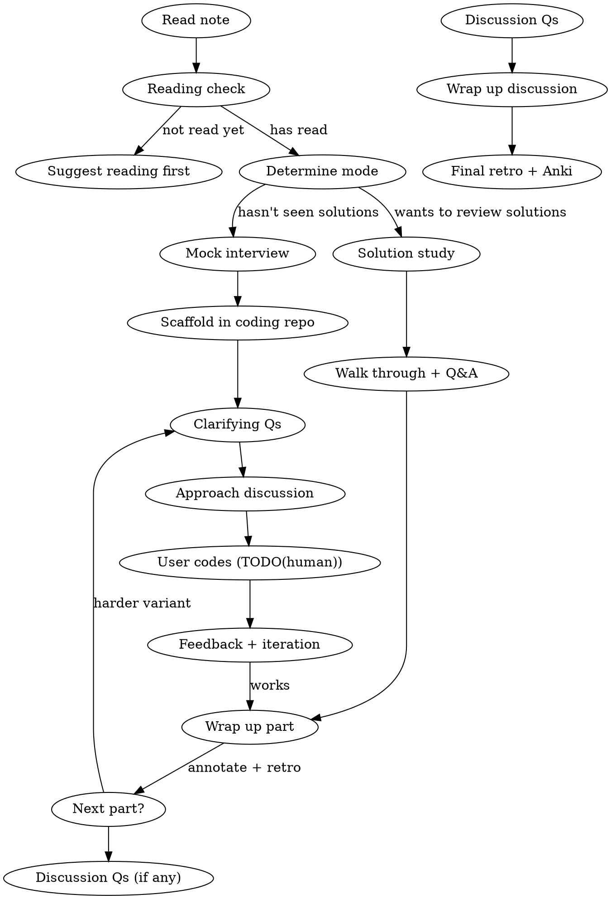

# Studying Coding Challenges

Interactive study flow for coding interview problems: confirm reading, run a mock session, annotate with the workspace's note format, create retro + Anki cards.

## Workflow

## Phase 0: Reading Check

1. Ask if they've read the **problem** (not solutions)
2. If not: suggest reading first. If yes: ask what's tricky — focuses the session.
3. **Mode:** No solutions seen → Mock interview. Has solutions → Solution study.

## Phase 1a: Mock Interview

Play interviewer. User codes; you facilitate and challenge.

### Setup: Scaffold in Coding Repo

Before the interview starts, set up runnable code in the user's configured coding challenge repo. If the repo path is unknown, ask for it.

1. Read local project instructions if present for conventions, naming, and test structure
2. Use the repo's existing scaffold command if one exists; otherwise create files following local conventions
3. Copy starter code from the problem note into the repo's existing solution location and language, preserving original method names and local naming conventions. If no convention is obvious, ask before choosing a path.
4. Write tests that demonstrate the bug/expected behavior:
   - Tests for correct behavior (should pass once fixed)
   - Tests that expose the specific bugs (should fail with buggy starter code)
   - Tests for edge cases, LRU ordering, etc.
5. Run tests to verify baseline: some pass (working parts), some fail (the bugs to fix)

If the coding-challenges repo has a scaffolding skill that handles the problem format, use it instead of manual setup.

### Interview Flow

**Step 1 — Clarifying Questions:** Let user ask. Answer as interviewer with concrete examples. If they skip: "Before you code — what would you ask an interviewer?"

**Step 2 — Approach Discussion:** Ask for data structures, algorithm choice, complexity. Give feedback without giving away the answer.

**Step 3 — User Codes:** Add `TODO(human)` in the solution file's code. Frame with Learn by Doing format (Context / Your Task / Guidance). **Wait for their code.** The TODO comment should be minimal — just the new command signature or a brief note. Do NOT write step-by-step refactoring instructions; an interviewer wouldn't hand you a checklist. **Preserve all method stubs and signatures** — place `TODO(human)` inside the existing structure, never collapse or replace stubs.

**Step 4 — Feedback:** Run tests. Review like an interviewer — correctness, edge cases, complexity. Ask them to fix issues; give hints, not answers. Iterate until tests pass.

**Step 5 — Multi-Part:** After wrapping up the current part, confirm readiness before next part. For each new coding part:

- Add new tests to the existing test file
- **Never rewrite or reformat existing working code** — only add new dispatch cases and TODO comments. Touching the user's code (removing types, changing structure) destroys their work and wastes interview time.
- Verify baseline (new tests fail, old tests still pass)
- Repeat the full cycle (clarify → approach → code → feedback)

Sections marked "for talking only" stay as discussion — don't ask for code.

## Phase 1b: Solution Study

Walk through solution pausing at key decisions. Ask "why this approach?" to test understanding. Discuss alternatives.

## Phase 2: Wrap Up (After Each Part)

Run this after **each coding part** and again after discussion questions — not just at the end.

### 2a: Annotate Problem Note (metadata only)

The problem note stays as a **clean problem spec** — only add metadata annotations:

- AI disclosure after frontmatter, in the workspace's normal format, if required (once, on first session)
- See-also annotation for alternate versions or related notes

Do NOT add study annotations or user solutions to the problem note. Those go in the mock session doc (2b).

### 2b: Create/Update Mock Session Retro

Create a retro note in the **same folder** as the problem note:

- **Filename:** `<Problem Name> - Mock Session <YYYY-MM-DD>.md`
- **Structure per part:**
  - Time, Finished (Yes/No/Partial), Pattern
  - What went well
  - Where I got stuck (numbered, specific mistakes with what happened)
  - Key insight to remember
  - Would I pass this in an interview? (Yes/Probably/No)
  - Discussion log (clarifying Qs, approach, key decisions)
  - Iteration history (each attempt with what failed and why)
  - Study annotations placed **contextually after the relevant part** they relate to:
    - `[!question]` conceptual Q&A, `[!warning]` gotchas/bugs, `[!info]` context/patterns, `[!example]` worked examples
    - Use Obsidian callouts and highlights when supported; otherwise use plain Markdown headings, blockquotes, bullets, or bold text
- **Discussion questions** get their own section with bullet summaries
- **`## My Solution`** at the end — user's final code for all parts

### 2c: Update Coding Retro or Journal

Find the user's coding retro or journal location. If none exists, create or update a retro note near the session note. Link to the full mock session retro using the workspace's link convention.

### 2d: Create Anki Cards

Invoke the `accelerated-learning:creating-anki-cards` skill to create flashcards from the session. Use the workspace's existing Anki/card output location; ask before creating a new one. Focus on:

- Gotchas and mistakes made during the session
- Key insights and patterns
- Discussion question takeaways (for discussion parts)

Check existing YAML files to avoid duplicates; add to existing file if the topic already has one.

## Phase 3: Discussion Questions

For "talk only" sections in the problem note:

1. Ask each question, let user discuss
2. Push back, probe deeper, ask follow-ups
3. Share insights the user missed
4. After all questions: wrap up with annotations, retro entries, and Anki cards

## Phase 4: Quiz (Optional)

3-5 application questions: "What breaks if [change]?" "How would you modify for [constraint]?"

## Common Mistakes

| Mistake                                  | Fix                                                                                                                                                                   |
| ---------------------------------------- | --------------------------------------------------------------------------------------------------------------------------------------------------------------------- |
| Giving away the solution                 | Ask leading questions, don't state answers                                                                                                                            |
| Writing code for the user                | Use TODO(human) + Learn by Doing                                                                                                                                      |
| Skipping clarifying questions            | Redirect: "What would you ask first?"                                                                                                                                 |
| Study annotations in problem note        | Study annotations go in mock session doc, contextually after the relevant part. Problem note stays as clean spec                                                      |
| Annotations grouped at end               | Place after relevant part in mock session doc, not lumped into one section                                                                                            |
| Coding "discussion only" questions       | Honor the note's labels                                                                                                                                               |
| Missing AI disclosure policy             | Follow the workspace's disclosure convention when the session note is substantially AI-assisted                                                                        |
| Summarizing problem back                 | They've read it — jump to engagement                                                                                                                                  |
| No runnable tests                        | Use the configured coding repo or ask for one, then create failing tests                                                                                               |
| Wrapping up only at the end              | Wrap up after each coding part and after discussion                                                                                                                   |
| Skipping retro/Anki                      | Always create retro note, update journal, and create Anki cards                                                                                                       |
| Prescribing design decisions             | Let user choose format/approach; test behavior not implementation                                                                                                     |
| Rewriting user's existing code           | Only add new code (TODOs, dispatch cases, tests). Never rewrite, reformat, or strip types/annotations from working code — it destroys the user's work and wastes time |
| Over-detailed TODO comments              | Keep TODOs minimal: command signature + brief description. Don't write step-by-step refactoring checklists — an interviewer wouldn't hand you one                     |
| Giving away the design in Guidance       | Guidance should mention trade-offs and constraints, not prescribe the exact data structure changes or implementation steps                                            |
| Renaming methods from starter code       | Preserve original naming (camelCase, etc.) from OA/LeetCode starter code — only use Pythonic naming for problems we create ourselves                                  |
| Collapsing method stubs into single TODO | Place `TODO(human)` inside existing stubs — never delete or merge method signatures into one comment. The stubs ARE the scaffolding                                   |
