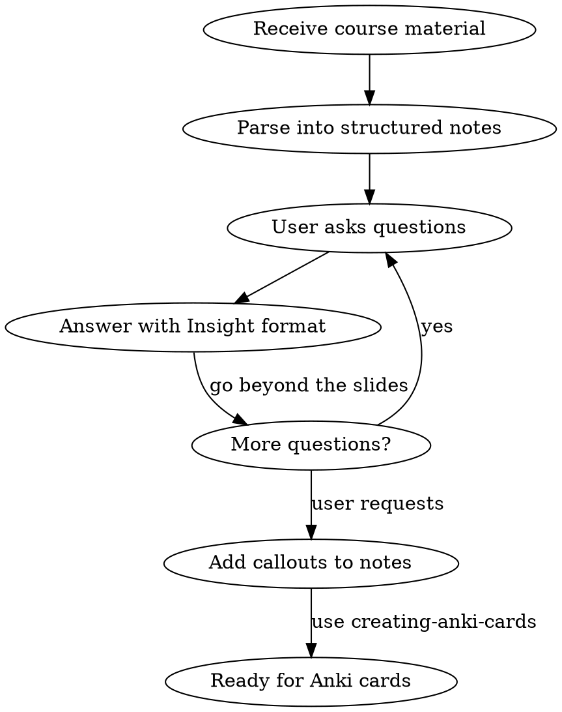

# Studying Course Materials

## Overview

Parse course materials into structured markdown notes, then simulate the lecture experience through interactive Q&A. Core principle: **the questions you ask about material reveal gaps that passive reading misses.** Q&A gets preserved as Obsidian callouts in the notes for review and Anki card generation.

## When to Use

- User provides course material (PDF, markdown, or URL) and wants notes
- User is studying slides/lectures downloaded without access to the actual lecture
- User asks questions about course material already parsed into notes
- User wants Q&A added as callouts to existing notes

## Workflow

## Phase 1: Parsing Material

### Supported Formats

- **PDF**: Use `pdftotext` (requires poppler: `brew install poppler`)
- **Markdown**: Read directly
- **Website**: Use WebFetch to extract content

### Note Structure

- Match the existing file's frontmatter and heading hierarchy
- Lecture/chapter title as `##` heading
- Organize hierarchically: `###` for major sections, `####` for subsections
- **Bold** for key terms, *italics* for definitions
- Preserve the narrative arc — notes should tell the same story as the slides

### What to Include

- Key concepts and definitions
- Examples and activities from slides
- Relationships between concepts (what leads to what)
- Historical progression if present

### What to Skip

- Course logistics (grading, policies) unless user wants them
- Redundant slide content (slides repeat across transitions)

## Phase 2: Interactive Q&A

When the user asks questions about the material:

1. **Go beyond the slides** — provide context, history, and connections the lecturer would have given verbally
2. **Use concrete examples** — code snippets, analogies, worked problems
3. **Connect to the lecture narrative** — explain where this concept fits in the broader story
4. **Be honest about limitations** — if a question goes beyond the material, say so

## Phase 3: Adding Callouts to Notes

When the user asks to add Q&A to the notes:

### Callout Types

| Type | Use for |
|------|---------|
| `[!question]` | Q&A about concepts ("Does AI pass the Turing test?") |
| `[!example]` | Concrete examples, code samples, worked problems |
| `[!info]` | Supplementary context and background knowledge |
| `[!warning]` | Common misconceptions or gotchas |

### Placement and Formatting

- Place callouts **contextually after the relevant bullet point**, not grouped at the end
- Each callout should be self-contained — readable without conversation context
- Synthesize the Q&A; don't paste raw conversation
- **No tables inside blockquotes** — Obsidian renders them incorrectly; use bullet lists
- Use `==highlights==` for key takeaways within callouts
- One concept per callout

## Integration with Anki Cards

Notes with callouts are ideal source material for `creating-anki-cards`:

- `[!question]` callouts map directly to Q&A cards
- `[!example]` callouts provide concrete details for gotcha cards
- Bold/highlighted terms in callouts suggest card-worthy concepts

## Common Mistakes

| Mistake | Fix |
|---------|-----|
| Dumping all Q&A at the bottom of notes | Place callouts after the relevant bullet point |
| Using tables inside callout blockquotes | Use bullet lists — tables break in Obsidian |
| Answering only from slide content | Go beyond — add context, examples, connections |
| Making callouts too long | Synthesize; one concept per callout |
| Listing facts without narrative | Notes should tell the same story as the slides |
