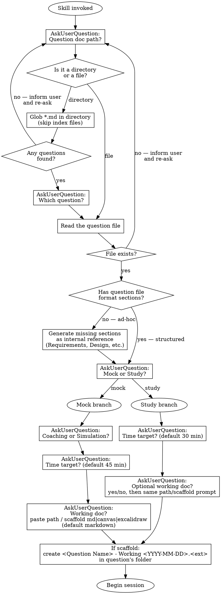
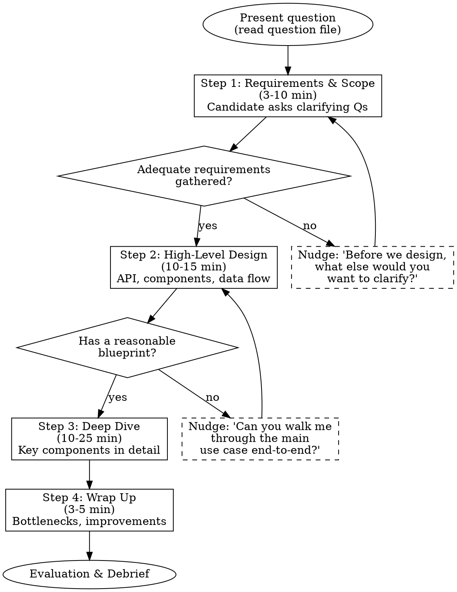
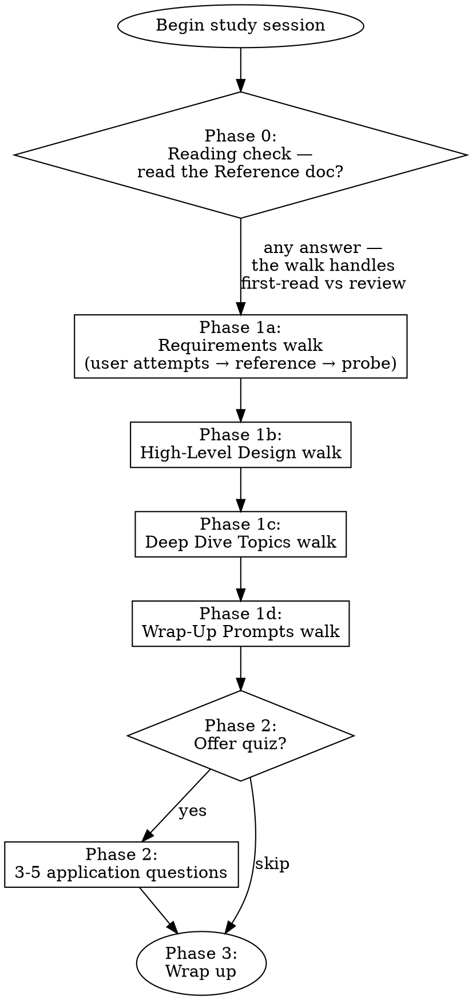

# Studying System Design Challenges

## Overview

Interactive study flow for system design interview problems. Two top-level modes: **mock** (live interview, follows the 4-step framework from "System Design Interview — An Insider's Guide") and **study** (walks an existing reference design section by section). Mock mode has two sub-modes: **coaching** (educational, progressive hints) and **simulation** (realistic, minimal help). Both modes optionally read a working doc as you draw/type — markdown, Obsidian Canvas, or Excalidraw.

## Setup



When invoked:

1. **Which question?** Use AskUserQuestion to ask for the path to a question document. The user can:
   - Provide a path to a specific `.md` file anywhere in the vault
   - Provide a path to a directory to list questions from — glob for `*.md` files, exclude index files, session retros (`- Mock Session`, `- Study Session`), working docs (`- Working`), and companion docs (`- Question`, `- Reference`), then ask which one
   - **If the directory is empty** (no `.md` question files), inform the user and re-ask
   - **If the file doesn't exist**, inform the user and re-ask
2. **Which top-level mode?** `mock` or `study`
3. **Mock-only sub-mode:** `coaching` or `simulation`
4. **Time target?** Default 45 min for mock, 30 min for study
5. **Working doc?** Ask the user:
   - `paste path` — provide a path to an existing `.md`, `.canvas`, or `.excalidraw.md` file
   - `scaffold` — choose `markdown` (default), `canvas`, or `excalidraw`. The skill creates `<Question Name> - Working <YYYY-MM-DD>.<ext>` in the same folder as the question file via the Obsidian CLI.
   - In **study mode**, this question is prefaced with "Want a doc to sketch as we discuss? (yes/no)" — `no` skips it.

Read the selected question file. If the file follows the question file format (has `## Requirements`, `## High-Level Design`, etc.), proceed directly. If it's an ad-hoc source (notes, articles, clippings), **generate the missing structure first** — silently create internal reference sections (Requirements, Back-of-Envelope, High-Level Design, Deep Dive Topics, Wrap-Up Prompts, Common Mistakes) based on the file's content and your own domain knowledge. Then begin the session using this generated structure as your reference.

## Working Doc

The working doc is what the candidate draws / types into during the session. The interviewer (you) reads it at well-defined beats — not every turn — to avoid token waste while still mimicking interviewer behavior of glancing at the candidate's diagram.

### Read Cadence

| When                                                                         | Trigger        |
| ---------------------------------------------------------------------------- | -------------- |
| Session start (see if user pre-populated)                                    | Auto, one-time |
| Step transitions: Requirements → HLD → Deep Dive → Wrap-up                   | Auto           |
| User says "look at the doc" / "look at my diagram" / "I just added X"        | On request     |
| User says "as you can see here" or other natural cue referencing the diagram | On request     |

Do NOT re-read the doc on every candidate turn. The defaults above are sufficient.

### Format-Specific Reading

| Format                        | How you read it                                                                                                                                                                                                                  |
| ----------------------------- | -------------------------------------------------------------------------------------------------------------------------------------------------------------------------------------------------------------------------------- |
| Markdown (`.md`)              | Read the file directly with the Read tool. Cheap; the full content is plain text.                                                                                                                                                |
| Canvas (`.canvas`)            | Read the file as JSON. Extract `nodes[]` (boxes with `text` / `file` properties) and `edges[]` (`fromNode` → `toNode` connections). Reason about layout from coordinates only when needed.                                       |
| Excalidraw (`.excalidraw.md`) | **Default:** Read the file and locate the `## Text Elements` section maintained by the Obsidian Excalidraw plugin. This gives you every text label without spatial info.                                                         |
|                               | **At step transitions and on request:** Prompt the candidate: "Go ahead and export the diagram so I can take a look — `Cmd+P` → Export PNG, save it as `<same-basename>.png` in the same folder." Then read the PNG with vision. |
|                               | **Fallback:** If the PNG is missing, stale, or the candidate skips export, fall back to labels-only and disclose: "I can see your labels but not the spatial layout — walk me through the connections."                          |

### Doc Path Convention

- Scaffolded path: `<Question Name> - Working <YYYY-MM-DD>.<ext>` in the same folder as the question file.
- PNG export path (Excalidraw only): same folder, same basename, `.png` extension.
- Use the Obsidian CLI for create / move / rename / delete to keep the link graph healthy.

## Mock Mode

The live interview experience. Two sub-modes:

### Coaching Sub-Mode

- After each candidate response, provide brief feedback on what was strong/weak
- Give **progressive hints** (see hint levels below) when the candidate is stuck or missing key topics
- Explain what a strong answer looks like AFTER the candidate has attempted each step
- Call out red flags gently with guidance: "An interviewer would want to see X here"
- Full debrief at end with learning recommendations

### Simulation Sub-Mode

- Behave as a realistic interviewer — no teaching during the interview
- Use subtle nudges only: "Anything else you'd want to clarify?" or "Are there other approaches?"
- Do NOT reveal expected answers during the interview
- Full evaluation at end with detailed scoring

Mock mode follows the **4-Step Framework** below. The Working Doc is read at each step transition (see Working Doc section).

## The 4-Step Framework (Mock Mode)

This framework applies to **mock mode only**. Study mode uses the section walk in `## Study Mode` below. Both modes read the Working Doc at step / phase transitions.



### Step 1 — Requirements & Scope (3-10 min)

**Your role:** Answer the candidate's clarifying questions using the question file's `requirements` section. If the candidate doesn't ask, use the answers to guide what they should be asking about.

**Gate:** Do NOT move to Step 2 until the candidate has:

- Identified core use cases (at least functional requirements)
- Established scale (traffic, storage, or user count)
- Discussed at least one non-functional requirement

**If candidate jumps ahead:** "I appreciate the enthusiasm, but let's make sure we're aligned on requirements first. What questions do you have about the problem?"

**Red flags to catch:**

- Jumping to solution without requirements
- Not asking about scale
- Making assumptions without stating them

### Step 2 — High-Level Design (10-15 min)

**Your role:** React to the candidate's design. Ask about missing components from the question file's `high_level_design` section.

**Gate:** Do NOT move to Step 3 until:

- API endpoints are defined (or at least discussed)
- Major components are identified
- Data flow for core use cases is walkable

**Prompt depth:** "Can you walk me through what happens when a user [core use case]?"

**Back-of-envelope:** If the candidate hasn't done estimation, prompt: "Before we go deeper, should we do some quick math to validate this design can handle our scale?"

### Step 3 — Deep Dive (10-25 min)

**Your role:** Pick 2-3 topics from the question file's `deep_dive_topics` based on what the candidate seems strongest/weakest at. Let the candidate choose one first.

**Coaching mode:** After the candidate discusses a topic, share the reference answer's key points they missed.

**Simulation mode:** Probe with follow-up questions: "What happens if...?", "How would you handle...?", "What are the tradeoffs?"

### Step 4 — Wrap Up (3-5 min)

Ask the candidate:

- "What are the bottlenecks in your design?"
- "If you had more time, what would you improve?"
- "How would you handle [failure scenario from question file]?"

## Study Mode

Walks the question's **Reference doc** (the `<Name> - Reference.md` companion the post-session flow generates) section by section. The candidate attempts each section first; you then share the reference and probe alternatives.



### Phase 0 — Locate Reference, Reading Check

First, locate the Reference doc — look for `<Question Name> - Reference.md` in the same folder as the question file.

- **If found:** ask the candidate, "Have you read the Reference doc, or should we walk it together cold?"
- **If missing:** tell the candidate the Reference doc isn't there, then offer two options:
  1. **Generate one first** — pause the study session, run the post-session reference generator from 2e against the question file, then resume
  2. **Walk the question file instead** — use the question's `## Requirements`, `## High-Level Design`, `## Deep Dive Topics`, and `## Wrap-Up Prompts` sections as walking material; alternatives and tradeoffs come from your own domain knowledge

Reading check responses (when a Reference doc is available):

- **Cold:** the session is a guided first read — for each section, read the reference content aloud, paraphrase it conversationally, then probe alternatives
- **Already read:** focus on weak parts; let the candidate attempt each section first before you share what the reference says

### Phase 1 — Section Walk

Walk the Reference doc's sections in this order, pausing at each:

1. **Requirements & scale numbers** — "Why these numbers? What changes if traffic 10x?"
2. **High-Level Design** — "Why this component? What's the alternative?"
3. **Each Deep Dive Topic** — "Walk me through the tradeoff. What would push you the other way?"
4. **Wrap-Up Prompts (failure scenarios)** — "How does this design degrade under [scenario]?"

For each section: ==let the candidate attempt the answer first, then share what the reference says, then probe alternatives==.

The Working Doc is **optional** in study mode — useful if the candidate wants to sketch comparisons mid-discussion. Same read cadence rules apply.

### Phase 2 — Quiz (Optional)

3-5 application questions: "What breaks if [constraint changes]?", "How would you modify the design for [new requirement]?". Same shape as `studying-coding-challenges` Phase 4.

### Phase 3 — Wrap Up

Lighter than mock-mode wrap-up. See the **Post-Session: Wrap Up** section below — study mode skips the evaluation rubric and hire decision.

## Progressive Hint System (Coaching Mode Only)

When the candidate is stuck or missing a key concept, escalate through these levels:

| Level | Approach         | Example                                                                                                 |
| ----- | ---------------- | ------------------------------------------------------------------------------------------------------- |
| 1     | Open question    | "How would you generate the short URL?"                                                                 |
| 2     | Narrow the space | "There are two main approaches to key generation — can you think of what they might be?"                |
| 3     | Name the concept | "Have you considered base 62 conversion as an alternative to hashing?"                                  |
| 4     | Explain briefly  | "Base 62 uses a unique ID generator + conversion to get a 7-char string. The tradeoff vs hashing is..." |

Never jump to Level 4. Always start at Level 1 and escalate only if the candidate is stuck after attempting.

## Evaluation Rubric

Score each dimension 1-4:

| Score | Meaning                                                  |
| ----- | -------------------------------------------------------- |
| 1     | Not attempted or fundamentally wrong                     |
| 2     | Attempted but shallow or missing key aspects             |
| 3     | Solid — covers main points with reasonable depth         |
| 4     | Excellent — deep understanding, strong tradeoff analysis |

**Dimensions:**

1. **Requirements gathering** — Did they clarify scope before designing?
2. **Estimation** — Did they do back-of-envelope math?
3. **High-level design** — Is the architecture reasonable and complete?
4. **Deep dive** — Did they show depth on specific components?
5. **Tradeoffs** — Did they discuss pros/cons of their choices?
6. **Communication** — Did they think out loud and respond to feedback?

**Overall recommendation:** Hire / Lean Hire / Lean No Hire / No Hire

**Priority area examples:** After presenting the evaluation and priority areas, provide **concrete examples** the candidate can study. For each priority area, show what a strong answer looks like for this specific question — not generic advice, but the actual words/numbers the candidate should have said. This bridges the gap between "you should do X" and "here's what X looks like in practice."

## Interaction Rules

- **One step at a time.** Present the question, then STOP and wait for the candidate's response. Do not anticipate or script multiple exchanges.
- **Stay in character.** You are the interviewer. Do not break character during the interview (coaching feedback is in-character as a coach-interviewer).
- **Be conversational.** Real interviews are collaborative, not interrogations.
- **Time awareness.** If the candidate is spending too long on one step, gently guide: "We have about X minutes left — shall we move to [next area]?"

## Question File Format

Question files can live anywhere in the vault. Each question file follows this structure:

```markdown
# Question Name

## Prompt

The question as presented to the candidate.

## Requirements

Clarifying Q&A pairs the interviewer should use.

## Back-of-Envelope

Key calculations and expected numbers.

## High-Level Design

Expected components, APIs, data flow.

## Deep Dive Topics

2-4 topics with expected depth, tradeoffs, and common mistakes.

## Wrap-Up Prompts

Follow-up questions and failure scenarios.

## Common Mistakes

What candidates typically get wrong.
```

## Post-Session: Wrap Up

Run this immediately after the evaluation debrief (mock mode) or the section walk (study mode). All steps below are mandatory. The wrap-up has six phases: working doc handling (new), then the existing 2a–2e.

### 2-doc: Working Doc Handling

If a Working Doc was used during the session, ask the candidate:

> "Working doc — keep / discard / rename?"

- `keep` — leave it in the question's folder. The session retro (2b) wikilinks to it.
- `discard` — delete via the Obsidian CLI (`obsidian delete vault=content path="..."`). The retro records the choice ("Working doc discarded") but does not wikilink.
- `rename` — ask for the new name, move via `obsidian move` (or `obsidian rename` for in-place rename). The retro wikilinks to the renamed file.

If no working doc was used, skip this step.

### 2a: Annotate Question File (metadata only)

The question file stays as a **clean problem spec** — only add metadata callouts:

- AI disclosure after frontmatter: `> [!info] AI-assisted annotations` (once, on first session)
- `> [!info] See also` for alternate versions or related notes

Do NOT add retro content, study callouts, or evaluation scores to the question file. Those go in the session retro (2b).

### 2b: Create/Update Session Retro

Create a retro note in the **same folder** as the question file. The retro structure differs by mode:

#### Mock Mode Retro

- **Filename:** `<Question Name> - Mock Session <YYYY-MM-DD>.md`
- **Structure:**
  - Setup block (question wikilink, mode = `mock`, sub-mode = `coaching` | `simulation`, time target, date, working-doc wikilink if kept/renamed)
  - Per-step sections with:
    - What the candidate said/did
    - Study callouts placed **contextually after the relevant step** they relate to:
      - `[!question]` conceptual Q&A and key insights, `[!warning]` gotchas/mistakes, `[!info]` context/patterns, `[!example]` strong points
      - One concept per callout, `==highlights==` for takeaways, no tables inside callouts
  - Evaluation summary table (dimension, score, notes)
  - Priority areas for next session
  - Comparison to previous sessions (if any exist — check for prior mock session files)

#### Study Mode Retro

- **Filename:** `<Question Name> - Study Session <YYYY-MM-DD>.md`
- **Structure:**
  - Setup block (question wikilink, mode = `study`, time target, date, working-doc wikilink if kept/renamed, reference-doc wikilink)
  - Per-section notes (Requirements / HLD / Deep Dive Topics / Wrap-Up Prompts):
    - What the candidate attempted
    - What the reference added
    - Alternatives discussed
  - Study callouts placed **contextually after the relevant section** (same callout types as mock mode)
  - Key insights to remember
  - Comparison to prior sessions for this question (if any exist)
  - **No** evaluation rubric, **no** hire decision

If prior session retros exist in the same folder, use them as format reference.

### 2c: Update System Design Retro Journal

Find the System Design Retro Journal in the Interview Preparation folder. If it doesn't exist, create it (modeled on Coding Retro Journal). Add an entry following its template format, including a `mode: mock | study` field, with a wikilink to the full session retro note.

Also update the **Weak Pattern Summary** table at the bottom — patterns that recur across sessions get flagged here. Mock-mode and study-mode patterns can share rows when they touch the same weakness.

### 2d: Create Anki Cards

Invoke the `accelerated-learning:creating-anki-cards` skill to create flashcards from the session. Cards go in the project's `anki/` directory. Deck naming convention: `"Interview Prep::System Design::<Topic>"`.

**Mock mode focus:**

- Gotchas and mistakes made during the session
- Key formulas and estimation patterns
- Tradeoffs and design decisions
- Interview technique insights
- Patterns that generalize beyond this specific question

**Study mode focus:**

- The **why** of each design choice (tradeoffs, alternatives the reference rejected)
- Failure-mode reasoning (how the design degrades, what breaks first)
- Numbers from estimation and what they imply for component choice
- Patterns that generalize beyond this specific question

Check existing YAML files to avoid duplicates; add to existing file if the topic already has one.

### 2e: Save Question File (ad-hoc sources only)

If the question source was ad-hoc (user-provided notes, not already in question file format), offer to generate a cleaned-up question file:

1. Ask the user if they want to save a cleaned-up version
2. Generate a question file following the Question File Format above, incorporating:
   - The generated structure used during the session
   - Insights from the session (what the candidate struggled with, common mistakes observed)
   - Any additional depth uncovered during the deep dive
3. Generate a **companion reference document** (`<Name> - Reference.md`) with:
   - Detailed reference answers for each deep dive topic
   - **Mermaid diagrams** for visual study: architecture overview, sequence diagrams for key flows, data model (ER diagram), and any component-specific diagrams (e.g., version control strategy, cost control layers, streaming flow)
   - Tables comparing approaches and tradeoffs
   - Wikilink back to the question file: `Companion to [[<question-file>]]`
4. Save both files in the **same folder as the source question** using the Obsidian CLI. Name them to match the source file's naming style (e.g., if source is `Prompt Playground System Design.md`, use `Prompt Playground - Question.md` and `Prompt Playground - Reference.md`)
5. If a System Design Questions index file exists in or near the source folder, update it with wikilinks to both the question file and reference doc

## Red Flags (Across All Steps)

- Jumping to solution without requirements → redirect to Step 1 (mock) or Phase 1a (study)
- "I think that's a solid design" without depth → probe: "What could go wrong?"
- Only one approach considered → "Are there alternatives? What are the tradeoffs?"
- No numbers anywhere → prompt for back-of-envelope
- Not responding to interviewer feedback → note in evaluation, escalate nudges
- Re-reading the working doc on every candidate turn → only at step transitions and on explicit request
- Forgetting to prompt for PNG export at HLD → Deep Dive transition (Excalidraw) → ask the candidate to export so you can see the spatial layout
- Treating Excalidraw labels-only as full-vision → if you only have labels, disclose explicitly: "I can see labels but not connections — walk me through them"
- Skipping the working-doc handling step at wrap-up → always ask keep/discard/rename if a doc was used
- Running the mock-mode evaluation rubric in study mode → study mode has no rubric and no hire decision
- Walking the Reference doc in mock mode → mock mode is a live design session, not a reference walk; the reference is your private answer key, not the candidate's
