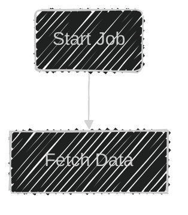
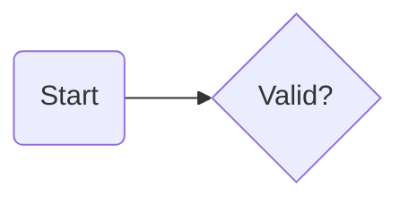

# Converting SVG to Mermaid

Convert rendered SVG flowcharts into pasteable Mermaid by reconstructing the graph from visible geometry. Treat SVG source as evidence, not as a suggestion: preserve nodes, edges, labels, shapes, layout direction, and ambiguity exactly.

## Workflow

1. Infer graph direction from coordinates: mostly increasing `x` means `flowchart LR`; mostly increasing `y` means `flowchart TD`. Use the dominant edge direction, not SVG width/height alone.
2. Inventory visible nodes from shapes and nearby text. Use short IDs from labels (`DLT` for "Dead Letter Topic", `RQ` for "Retry Queue"); keep labels exactly as displayed.
3. Map SVG primitives to Mermaid shapes before writing edges.
4. Trace each arrowhead or marker to establish edge direction. Preserve every edge label from nearby text.
5. Add Mermaid YAML frontmatter inside the same `mermaid` block only when SVG evidence supports it: hand-drawn/sketchy strokes use `config.look: handDrawn`; dark backgrounds with light strokes/text use `config.theme: dark`; forest/neutral only when colors clearly match.
6. Return a fenced Mermaid code block. Mermaid frontmatter still counts as code. If anything is ambiguous, add a brief note after the block naming the uncertainty instead of guessing silently.

## Shape Mapping

| SVG evidence | Mermaid shape |
|--------------|---------------|
| `rect` without `rx`/`ry` | `ID[Label]` |
| `rect` with rounded corners | `ID(Label)` |
| diamond `polygon` | `ID{Label}` |
| `circle` or ellipse | `ID((Label))` |
| parallelogram-like `polygon` | `ID[/Label/]` or `ID[\\Label\\]` matching slant |

## Edge Syntax

| SVG evidence | Mermaid syntax |
|--------------|----------------|
| Arrow from A to B, no label | `A --> B` |
| Arrow with label text | `A -->|label| B` |
| Dashed stroke | `A -.-> B` or `A -. label .-> B` |
| Thick or double stroke | preserve graph structure; omit styling unless user asks |

## Renderer Config



Omit this block when the SVG has ordinary strokes and no clear theme evidence.

## Example

```svg
<rect x="20" y="30" width="85" height="42" rx="12" />
<text x="62.5" y="56">Start</text>
<polygon points="180,20 235,51 180,82 125,51" />
<text x="180" y="56">Valid?</text>
<line x1="105" y1="51" x2="124" y2="51" marker-end="url(#arrow)" />
```



## Common Mistakes

| Mistake | Fix |
|---------|-----|
| Choosing `TD` because the SVG is tall | Follow node and edge coordinates |
| Treating rounded rectangles as stadium start/end nodes | Use rounded Mermaid nodes unless the label/shape clearly means terminal |
| Omitting edge labels because they are separate `<text>` elements | Associate text near an edge with that edge |
| Inventing branches for a diamond | Only output edges present in the SVG |
| Copying generated IDs from SVG internals | Use readable IDs derived from visible labels |
| Adding styles, classes, or commentary | Output only source reconstruction plus ambiguity notes |
